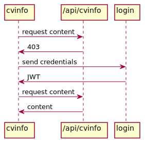

# CV-Info

[](https://github.com/cleaver/cv-info/actions/workflows/nodejs-ci.yaml)

A basic Node.js REST application to protect information on a static site.

This application is intended for use with a static site using a framework
such as Gatsby.js. The `user` endpoint checks the credentials and returns
a JWT. A valid JWT is required to access the `cv-info` endpoint.

## API

| Endpoint        | HTTP verb | Notes                                                                                                                                 |
|-----------------|-----------|---------------------------------------------------------------------------------------------------------------------------------------|
| /api/login      | POST      | Validate credentials.  Data: {username, password}.  Return: 200 with JWT, or 403 error.   |
| /api/cvinfo/:id | GET       | Retrieve resource by id. JWT passed in `Authorization` header.  Return: 200 with {details}, 403 if JWT missing/invalid, or 400 error.                               |



## Implementation

This implementation is intentially simple. Neither Express nor other frameworks
are used. There is a basic `server.js` to route the requests. All HTTP details
are managed here. The resource handlers (`user.js` and `cvinfo.js`) are not HTTP
aware. This is so they could be called from  API Gateway as an AWS Lambda, or
similar. There's no database, although it could easily be added.

The `auth` POST method checks agains a single username / password combination
stored as an environment variable. It could easily be changed to database
lookup.

The `cvinfo` GET method looks up a resource from a file. This could be replaced
by database lookup or some other resource.

## Running the application

Clone and install with `yarn` (or `npm`).

Copy the `.env.example` file to `.env` and make any edits.

To run the server for development or testing:

```bash
yarn develop
```

### Log in

To log in and retrieve a JWT token:

```bash
curl --location --request POST 'http://localhost:3000/api/login' \
--header 'Content-Type: application/json' \
--data-raw '{"username":"foo", "password":"bar"}'
```

You should get a response like this:

```json
{"message":"Here's your new token.","token":"__YOUR_JWT__)"}
```

Your token will be in the place of `__YOUR_JWT__`.

### Get data

To get data from the app, replace `__YOUR_JWT__` with the token you received
in the login request.

```bash
curl --location --request GET 'http://localhost:3000/api/cvinfo/sample' \
--header 'Authorization: __YOUR_JWT__'
```

### Generate new password

From the project directory, you can run `node` to open a CLI. In the CLI, type
the following:

```javascript
const bcrypt = require('bcrypt');
bcrypt.hash('your-new-password',10).then((hash)=>{console.log(hash)});
```

The new password hash will be displayed. Copy this to your `.env` file.

## Security

This application is not recommended for protecting important secrets. Use it to
better understand how you could use JWT for API auth. If you are planning your
own application, look for a proven and tested auth framework.

## Tests

Currently, there are only tests on the business logic in `src/handlers` which do 
the main work. There are no tests on the HTTP logic.
